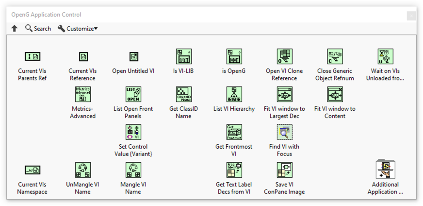

# OpenG Application Control Library

 

The OpenG Application Control Library package contains application control functions.

## Installation

[Install the OpenG Application Control Library with VIPM](https://www.vipm.io/package/oglib_appcontrol/) (a.k.a oglib_appcontrol)

## How to Contribute

Take a look at the [Help Wanted](https://github.com/vipm-io/OpenG-Application-Control/issues?q=is%3Aissue+is%3Aopen+label%3A%22help+wanted%22) issues list. If it's your first contribution or you're not extremely familiar with this library, you might want to look at the [Good First Issues](https://github.com/vipm-io/OpenG-Application-Control/issues?q=is%3Aissue+is%3Aopen+label%3Agood+first+issue) list.  If you see an issue that looks like one you can complete, add a comment to the issue stating you'd like to work on it, and a maintainer will follow up and "assigned" to you. You then create a branch and then submit your contribution in the form of a [Pull Requests](https://github.com/vipm-io/OpenG-Application-Control/pulls).

## Contributors

<!-- ALL-CONTRIBUTORS-LIST:START - Do not remove or modify this section -->
<!-- prettier-ignore-start -->
<!-- markdownlint-disable -->

<!-- markdownlint-restore -->
<!-- prettier-ignore-end -->

<!-- ALL-CONTRIBUTORS-LIST:END -->

